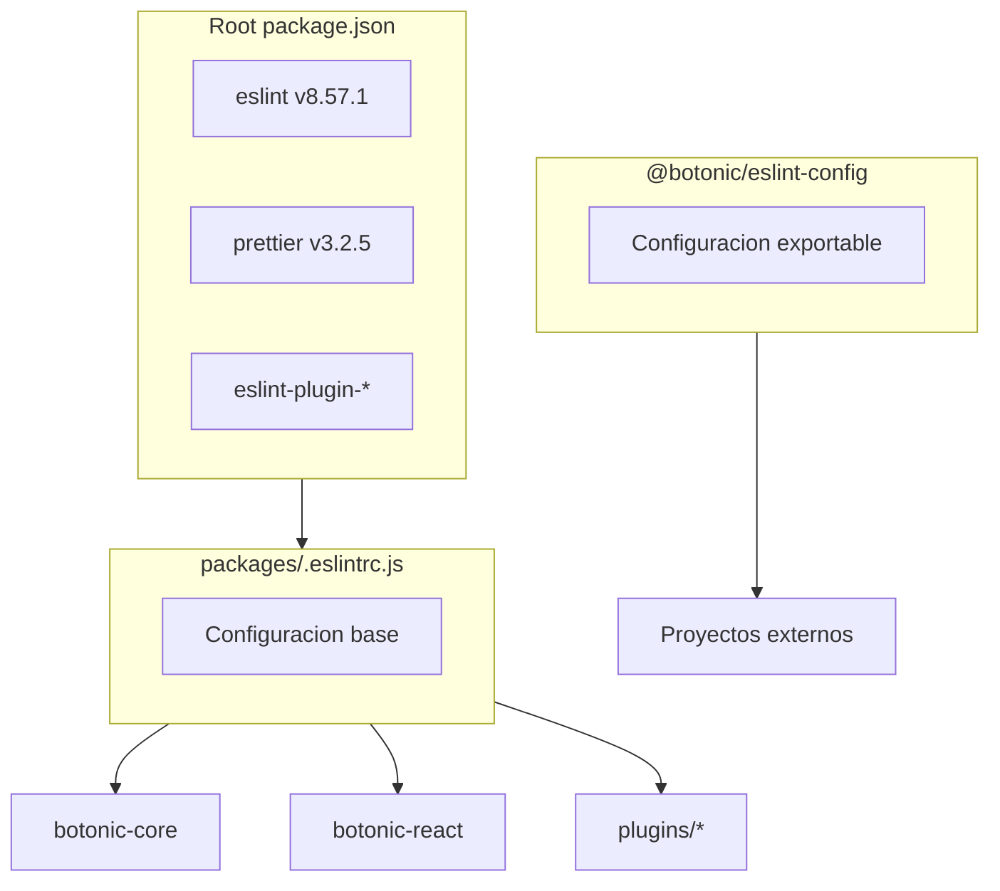

# Plan de Migración de ESLint/Prettier a Biome

## Contexto actual

El monorepo usa npm workspaces con la siguiente estructura de linting:

- **Root**: ESLint v8.57.1, Prettier v3.2.5
- **Configuración base**: `[packages/.eslintrc.js](packages/.eslintrc.js)`
- **Paquete exportable**: `@botonic/eslint-config` (usado por proyectos externos)
- **Prettier**: `[.prettierrc](.prettierrc)` con configuración personalizada



## Version de Biome

Usar **Biome v2.3.13** (versión estable más reciente, publicada el 26 de enero de 2025).

---

## Fase 1: Core y Plugins principales

### Paquetes incluidos

1. `botonic-core`
2. `botonic-plugin-hubtype-analytics`
3. `botonic-plugin-knowledge-bases`
4. `botonic-plugin-ai-agents`
5. `botonic-react`
6. `botonic-plugin-flow-builder`

### Pasos

#### 1.1 Instalar Biome en el root del monorepo

```bash
npm install --save-dev @biomejs/biome@2.3.13
```

#### 1.2 Crear configuración base de Biome

Crear `[biome.json](biome.json)` en el root con configuración equivalente a la actual:

- Formatter con las mismas opciones que `.prettierrc`
- Linter con reglas equivalentes a las de ESLint
- Organización de imports (reemplazo de `simple-import-sort`)

Configuración base a crear:

```json
{
  "$schema": "https://biomejs.dev/schemas/2.3.13/schema.json",
  "vcs": {
    "enabled": true,
    "clientKind": "git",
    "useIgnoreFile": true
  },
  "formatter": {
    "enabled": true,
    "indentStyle": "space",
    "indentWidth": 2,
    "lineWidth": 80
  },
  "javascript": {
    "formatter": {
      "quoteStyle": "single",
      "jsxQuoteStyle": "single",
      "semicolons": "asNeeded",
      "trailingCommas": "es5",
      "arrowParentheses": "asNeeded"
    }
  },
  "linter": {
    "enabled": true,
    "rules": {
      "recommended": true
    }
  },
  "organizeImports": {
    "enabled": true
  }
}
```

#### 1.3 Actualizar scripts en cada paquete de Fase 1

Cambiar en cada `package.json`:

```json
{
  "scripts": {
    "lint": "biome check --write src/",
    "lint:check": "biome check src/",
    "format": "biome format --write src/"
  }
}
```

#### 1.4 Ejecutar migración inicial con Biome

```bash
npx @biomejs/biome migrate eslint --write
npx @biomejs/biome migrate prettier --write
```

Esto ayudará a traducir reglas de ESLint a Biome automáticamente.

#### 1.5 Formatear código con Biome

Ejecutar en cada paquete de Fase 1:

```bash
npx biome check --write packages/botonic-core/src
npx biome check --write packages/botonic-plugin-hubtype-analytics/src
npx biome check --write packages/botonic-plugin-knowledge-bases/src
npx biome check --write packages/botonic-plugin-ai-agents/src
npx biome check --write packages/botonic-react/src
npx biome check --write packages/botonic-plugin-flow-builder/src
```

#### 1.6 Actualizar CI workflows

Actualizar los workflows de GitHub Actions para usar Biome en lugar de ESLint:

- `[botonic-core-tests.yml](.github/workflows/botonic-core-tests.yml)`
- `botonic-react-tests.yml`
- `botonic-plugin-*-tests.yml`

---

## Fase 2: CLI, DX, eslint-config y Examples

### Paquetes incluidos

1. `botonic-cli`
2. `botonic-dx`
3. `botonic-dx-bundler-webpack`
4. `botonic-dx-bundler-rspack`
5. `botonic-eslint-config` (deprecar y crear `@botonic/biome-config`)
6. `examples/blank`
7. `examples/blank-typescript`
8. `examples/flow-builder-typescript`

### Pasos

#### 2.1 Crear nuevo paquete `@botonic/biome-config`

Crear `[packages/botonic-biome-config/](packages/botonic-biome-config/)` con:

- `package.json` con la configuración exportable
- `biome.json` con la configuración base para proyectos externos
- `README.md` con instrucciones de uso

#### 2.2 Deprecar `@botonic/eslint-config`

- Añadir notice de deprecación en el README
- Marcar como deprecated en npm
- Mantener para compatibilidad con proyectos antiguos

#### 2.3 Migrar `botonic-cli`

Nota: Este paquete usa ESLint v9 con configuración específica de oclif. Requiere atención especial.

#### 2.4 Actualizar examples

- Actualizar dependencias a `@botonic/biome-config`
- Eliminar archivos `.eslintrc*` y `.prettierrc*`
- Crear `biome.json` que extienda la configuración base

#### 2.5 Actualizar `botonic-dx`

- Actualizar `[baseline/](packages/botonic-dx/baseline/)` con archivos de Biome
- Eliminar configuraciones de ESLint/Prettier

---

## Limpieza final

### Eliminar dependencias de ESLint/Prettier del root

Después de completar ambas fases, eliminar del `[package.json](package.json)` raíz:

- `eslint` y `eslint_d`
- `eslint-config-prettier`
- `eslint-plugin-*` (todos)
- `@typescript-eslint/*`
- `prettier`
- `eslint-import-resolver-typescript`

### Eliminar archivos de configuración obsoletos

- `[packages/.eslintrc.js](packages/.eslintrc.js)`
- `[.prettierrc](.prettierrc)`
- `.eslintignore` (si existe)

---

## Mapeo de reglas ESLint a Biome

Reglas clave a mapear:

- `prettier/prettier` -> Biome formatter (nativo)
- `simple-import-sort/*` -> `organizeImports` (nativo)
- `@typescript-eslint/no-explicit-any` -> `lint/suspicious/noExplicitAny`
- `@typescript-eslint/no-unused-vars` -> `lint/correctness/noUnusedVariables`
- `prefer-const` -> `lint/style/useConst`
- `eqeqeq` -> `lint/suspicious/noDoubleEquals`
- `no-console` -> `lint/suspicious/noConsoleLog` (actualmente off)
- `consistent-return` -> No hay equivalente directo (se puede ignorar)
- `complexity` -> No hay equivalente directo (se puede ignorar)

---

## Consideraciones adicionales

- **IDE Integration**: Biome tiene extensiones para VS Code y otros editores
- **Pre-commit hooks**: Actualizar `.pre-commit-config.yaml` para usar Biome
- **Editor config**: El archivo `.editorconfig` puede mantenerse como fallback
