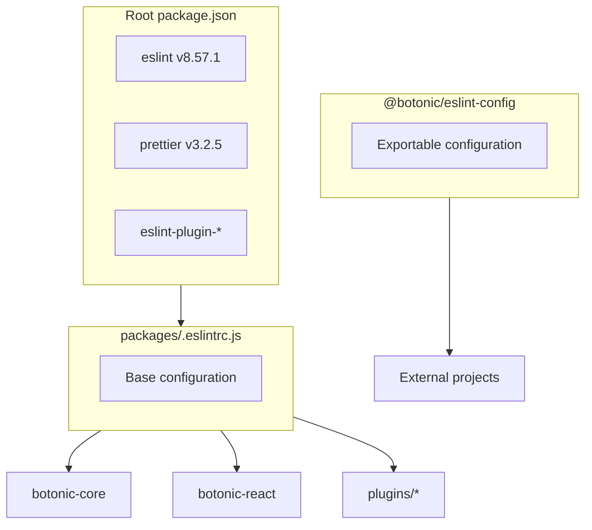

# ESLint/Prettier to Biome Migration Plan

## Current Context

The monorepo uses npm workspaces with the following linting structure:

- **Root**: ESLint v8.57.1, Prettier v3.2.5
- **Base configuration**: `[packages/.eslintrc.js](packages/.eslintrc.js)`
- **Exportable package**: `@botonic/eslint-config` (used by external projects)
- **Prettier**: `[.prettierrc](.prettierrc)` with custom configuration



## Biome Version

Use **Biome v2.3.13** (latest stable version, released January 26, 2025).

---

## Pre-commit Strategy (Hybrid Approach)

The pre-commit will use a **hybrid approach** during migration:

- **Native Biome hook**: For already migrated packages (more efficient, only analyzes staged files)
- **Current script (npm run lint)**: For packages still using ESLint

### Hybrid pre-commit configuration

Update `[.pre-commit-config.yaml](.pre-commit-config.yaml)`:

```yaml
repos:
  # ... existing pre-commit-hooks ...

  # Native Biome hook for migrated packages
  - repo: https://github.com/biomejs/pre-commit
    rev: v0.6.0
    hooks:
      - id: biome-check
        additional_dependencies: ['@biomejs/biome@2.3.13']
        # Update this pattern as each package is migrated
        files: ^packages/botonic-core/

  # ESLint hooks for packages NOT yet migrated (remove as they are migrated)
  - repo: local
    hooks:
      # Remove this hook when botonic-cli is migrated
      - id: cli
        name: cli (ESLint)
        entry: scripts/qa/old/lint-package.sh packages/botonic-cli
        language: system
        files: ^packages/botonic-cli/

      # Remove this hook when botonic-react is migrated
      - id: react
        name: react (ESLint)
        entry: scripts/qa/old/lint-package.sh packages/botonic-react
        language: system
        files: ^packages/botonic-react/

      # ... rest of ESLint hooks ...
```

### Progressive update

Each time a package is migrated:

1. **Add** the package pattern to the Biome hook:

```yaml
files: ^(packages/botonic-core/|packages/botonic-plugin-hubtype-analytics/)
```

1. **Remove** the corresponding local ESLint hook

---

## Phase 1: Core and Main Plugins

### Included packages

1. `botonic-core` (COMPLETED)
2. `botonic-plugin-hubtype-analytics`
3. `botonic-plugin-knowledge-bases`
4. `botonic-plugin-ai-agents`
5. `botonic-react`
6. `botonic-plugin-flow-builder`

### Steps per package

#### For each package:

1. **Update scripts** in `package.json`:

```json
{
  "scripts": {
    "lint": "biome check --write src/",
    "lint:check": "biome check src/",
    "format": "biome format --write src/"
  }
}
```

1. **Remove `eslintConfig**`from`package.json` if it exists
2. **Run Biome** to format and lint:

```bash
npx biome check --write src/
```

1. **Fix TypeScript errors** if Biome modifies `@ts-ignore` or imports
2. **Verify tests**:

```bash
npm test
```

1. **Update pre-commit**:

- Add package to the `files` pattern of the Biome hook
- Remove the local ESLint hook for the package

### CI Checklist for each migrated package

When migrating a package to Biome, follow these steps:

#### 1. Update package-specific workflow

In `.github/workflows/botonic-<package>-tests.yml`, add the `LINT_COMMAND` input:

```yaml
jobs:
  botonic-<package>-tests:
    uses: ./.github/workflows/botonic-common-workflow.yml
    secrets: inherit
    with:
      PACKAGE_NAME: Botonic <package> tests
      PACKAGE: botonic-<package>
      LINT_COMMAND: npm run lint:check # <-- Add this line
      # ... other inputs ...
```

> **Note**: The `botonic-common-workflow.yml` already has the `LINT_COMMAND` input with default value `npm run lint_core` for non-migrated packages.

#### 2. Update `.pre-commit-config.yaml`

Add the package to the `files` pattern of the Biome hook:

```yaml
- id: biome-check
  name: biome-check (Biome)
  entry: npx @biomejs/biome check --write
  language: system
  files: ^packages/(botonic-core|botonic-<new-package>)/ # <-- Add here
  types_or: [javascript, jsx, ts, tsx, json]
```

And **remove** the ESLint hook for the migrated package.

#### 3. Update `.prettierignore`

Add the package to avoid conflicts between Prettier and Biome:

```
# Packages migrated to Biome (add more as they are migrated)
packages/botonic-core/
packages/botonic-<new-package>/  # <-- Add here
```

#### 4. Format and fix errors

```bash
# Format with Biome
cd packages/botonic-<package>
npx @biomejs/biome check --write src/ tests/

# Verify there are no errors (only warnings allowed)
npx @biomejs/biome check src/ tests/
```

**Common errors to fix:**

- `noImplicitAnyLet`: Add types to untyped `let` variables
- `noUnusedVariables`: Rename unused variables with `_` prefix
- Type-only imports: Use `import type { ... }`

#### 5. Run tests

```bash
npm test
```

---

### CI Configuration Files (reference)

| File                                            | Purpose                                               |
| ----------------------------------------------- | ----------------------------------------------------- |
| `.github/workflows/botonic-common-workflow.yml` | Reusable workflow with `LINT_COMMAND` input           |
| `.github/workflows/pre-commit.yml`              | Installs Biome globally before running pre-commit     |
| `.pre-commit-config.yaml`                       | Local Biome hook for migrated packages                |
| `.prettierignore`                               | Prevents Prettier from reformatting migrated packages |
| `.vscode/settings.json`                         | Biome as default formatter in the IDE                 |

---

## Phase 2: CLI, DX, eslint-config and Examples

### Included packages

1. `botonic-cli`
2. `botonic-dx`
3. `botonic-dx-bundler-webpack`
4. `botonic-dx-bundler-rspack`
5. `botonic-eslint-config` (deprecate and create `@botonic/biome-config`)
6. `examples/blank`
7. `examples/blank-typescript`
8. `examples/flow-builder-typescript`

### Steps

#### 2.1 Create new `@botonic/biome-config` package

Create `[packages/botonic-biome-config/](packages/botonic-biome-config/)` with:

- `package.json` with exportable configuration
- `biome.json` with base configuration for external projects
- `README.md` with usage instructions

#### 2.2 Deprecate `@botonic/eslint-config`

- Add deprecation notice in README
- Mark as deprecated on npm
- Keep for backwards compatibility with old projects

#### 2.3 Migrate `botonic-cli`

Note: This package uses ESLint v9 with oclif-specific configuration. Requires special attention.

#### 2.4 Update examples

- Update dependencies to `@botonic/biome-config`
- Remove `.eslintrc*` and `.prettierrc*` files
- Create `biome.json` that extends base configuration

#### 2.5 Update `botonic-dx`

- Update `[baseline/](packages/botonic-dx/baseline/)` with Biome files
- Remove ESLint/Prettier configurations

---

## Final Cleanup

### Remove ESLint/Prettier dependencies from root

After completing both phases, remove from root `[package.json](package.json)`:

- `eslint` and `eslint_d`
- `eslint-config-prettier`
- `eslint-plugin-*` (all)
- `@typescript-eslint/*`
- `prettier`
- `eslint-import-resolver-typescript`

### Remove obsolete configuration files

- `[packages/.eslintrc.js](packages/.eslintrc.js)`
- `[.prettierrc](.prettierrc)`
- `.eslintignore` (if exists)

### Simplify pre-commit

At the end, pre-commit will only have the Biome hook:

```yaml
- repo: https://github.com/biomejs/pre-commit
  rev: v0.6.0
  hooks:
    - id: biome-check
      additional_dependencies: ['@biomejs/biome@2.3.13']
```

---

## ESLint to Biome Rules Mapping

Key rules mapped in `[biome.json](biome.json)`:

- `prettier/prettier` -> Biome formatter (native)
- `simple-import-sort/*` -> `assist.actions.source.organizeImports`
- `@typescript-eslint/no-explicit-any` -> `suspicious.noExplicitAny: warn`
- `@typescript-eslint/no-unused-vars` -> `correctness.noUnusedVariables: warn`
- `prefer-const` -> `style.useConst: error`
- `eqeqeq` -> `suspicious.noDoubleEquals: error`
- `no-console` -> `suspicious.noConsole: off`
- `complexity` -> `complexity.noExcessiveCognitiveComplexity: warn`

---

## Additional Considerations

- **IDE Integration**: Install Biome extension for VS Code
- **Editor config**: The `.editorconfig` file can be kept as fallback
- **Plan file**: This plan is located at `[.cursor/plans/BIOME_MIGRATION.plan.md](.cursor/plans/BIOME_MIGRATION.plan.md)` for team tracking
