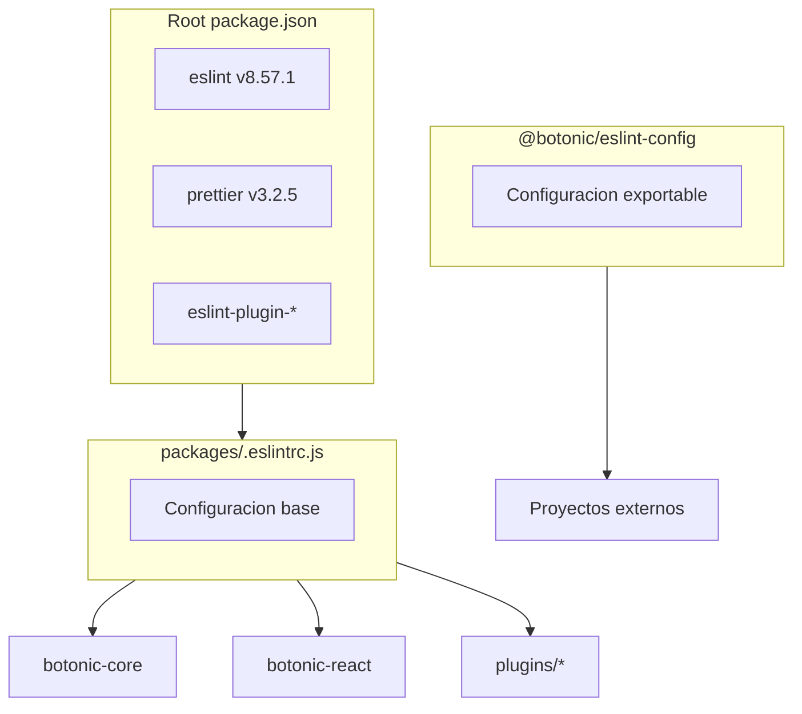

# Plan de Migración de ESLint/Prettier a Biome

## Contexto actual

El monorepo usa npm workspaces con la siguiente estructura de linting:

- **Root**: ESLint v8.57.1, Prettier v3.2.5
- **Configuración base**: `[packages/.eslintrc.js](packages/.eslintrc.js)`
- **Paquete exportable**: `@botonic/eslint-config` (usado por proyectos externos)
- **Prettier**: `[.prettierrc](.prettierrc)` con configuración personalizada



## Version de Biome

Usar **Biome v2.3.13** (versión estable más reciente, publicada el 26 de enero de 2025).

---

## Estrategia de Pre-commit (Enfoque Hibrido)

El pre-commit usará un **enfoque híbrido** durante la migración:

- **Hook nativo de Biome**: Para paquetes ya migrados (más eficiente, solo analiza archivos staged)
- **Script actual (npm run lint)**: Para paquetes que aún usan ESLint

### Configuración del pre-commit híbrido

Actualizar `[.pre-commit-config.yaml](.pre-commit-config.yaml)`:

```yaml
repos:
  # ... hooks existentes de pre-commit-hooks ...

  # Hook nativo de Biome para paquetes migrados
  - repo: https://github.com/biomejs/pre-commit
    rev: v0.6.0
    hooks:
      - id: biome-check
        additional_dependencies: ['@biomejs/biome@2.3.13']
        # Actualizar este patron conforme se migre cada paquete
        files: ^packages/botonic-core/

  # Hooks de ESLint para paquetes NO migrados (ir eliminando conforme se migre)
  - repo: local
    hooks:
      # Eliminar este hook cuando se migre botonic-cli
      - id: cli
        name: cli (ESLint)
        entry: scripts/qa/old/lint-package.sh packages/botonic-cli
        language: system
        files: ^packages/botonic-cli/

      # Eliminar este hook cuando se migre botonic-react
      - id: react
        name: react (ESLint)
        entry: scripts/qa/old/lint-package.sh packages/botonic-react
        language: system
        files: ^packages/botonic-react/

      # ... resto de hooks de ESLint ...
```

### Actualización progresiva

Cada vez que se migre un paquete:

1. **Añadir** el patrón del paquete al hook de Biome:

```yaml
files: ^(packages/botonic-core/|packages/botonic-plugin-hubtype-analytics/)
```

1. **Eliminar** el hook local de ESLint correspondiente

---

## Fase 1: Core y Plugins principales

### Paquetes incluidos

1. `botonic-core` (COMPLETADO)
2. `botonic-plugin-hubtype-analytics`
3. `botonic-plugin-knowledge-bases`
4. `botonic-plugin-ai-agents`
5. `botonic-react`
6. `botonic-plugin-flow-builder`

### Pasos por paquete

#### Para cada paquete:

1. **Actualizar scripts** en `package.json`:

```json
{
  "scripts": {
    "lint": "biome check --write src/",
    "lint:check": "biome check src/",
    "format": "biome format --write src/"
  }
}
```

1. **Eliminar `eslintConfig**`del`package.json` si existe
2. **Ejecutar Biome** para formatear y lint:

```bash
npx biome check --write src/
```

1. **Corregir errores** de TypeScript si Biome modifica `@ts-ignore` o imports
2. **Verificar tests**:

```bash
npm test
```

1. **Actualizar pre-commit**:

- Añadir paquete al patrón `files` del hook de Biome
- Eliminar hook local de ESLint del paquete

### Checklist de CI para cada paquete migrado

Al migrar un paquete a Biome, seguir estos pasos:

#### 1. Actualizar workflow específico del paquete

En `.github/workflows/botonic-<paquete>-tests.yml`, añadir el input `LINT_COMMAND`:

```yaml
jobs:
  botonic-<paquete>-tests:
    uses: ./.github/workflows/botonic-common-workflow.yml
    secrets: inherit
    with:
      PACKAGE_NAME: Botonic <paquete> tests
      PACKAGE: botonic-<paquete>
      LINT_COMMAND: npm run lint:check # <-- Añadir esta línea
      # ... otros inputs ...
```

> **Nota**: El `botonic-common-workflow.yml` ya tiene el input `LINT_COMMAND` con valor por defecto `npm run lint_core` para paquetes no migrados.

#### 2. Actualizar `.pre-commit-config.yaml`

Añadir el paquete al patrón `files` del hook de Biome:

```yaml
- id: biome-check
  name: biome-check (Biome)
  entry: npx @biomejs/biome check --write
  language: system
  files: ^packages/(botonic-core|botonic-<nuevo-paquete>)/ # <-- Añadir aquí
  types_or: [javascript, jsx, ts, tsx, json]
```

Y **eliminar** el hook de ESLint del paquete migrado.

#### 3. Actualizar `.prettierignore`

Añadir el paquete para evitar conflictos entre Prettier y Biome:

```
# Packages migrated to Biome (add more as they are migrated)
packages/botonic-core/
packages/botonic-<nuevo-paquete>/  # <-- Añadir aquí
```

#### 4. Formatear y corregir errores

```bash
# Formatear con Biome
cd packages/botonic-<paquete>
npx @biomejs/biome check --write src/ tests/

# Verificar que no hay errores (solo warnings permitidos)
npx @biomejs/biome check src/ tests/
```

**Errores comunes a corregir:**

- `noImplicitAnyLet`: Añadir tipos a variables `let` sin tipo
- `noUnusedVariables`: Renombrar variables no usadas con prefijo `_`
- Imports solo de tipos: Usar `import type { ... }`

#### 5. Ejecutar tests

```bash
npm test
```

---

### Archivos de configuración de CI (referencia)

| Archivo                                         | Propósito                                              |
| ----------------------------------------------- | ------------------------------------------------------ |
| `.github/workflows/botonic-common-workflow.yml` | Workflow reutilizable con input `LINT_COMMAND`         |
| `.github/workflows/pre-commit.yml`              | Instala Biome globalmente antes de ejecutar pre-commit |
| `.pre-commit-config.yaml`                       | Hook local de Biome para paquetes migrados             |
| `.prettierignore`                               | Evita que Prettier reformatee paquetes migrados        |
| `.vscode/settings.json`                         | Biome como formateador por defecto en el IDE           |

---

## Fase 2: CLI, DX, eslint-config y Examples

### Paquetes incluidos

1. `botonic-cli`
2. `botonic-dx`
3. `botonic-dx-bundler-webpack`
4. `botonic-dx-bundler-rspack`
5. `botonic-eslint-config` (deprecar y crear `@botonic/biome-config`)
6. `examples/blank`
7. `examples/blank-typescript`
8. `examples/flow-builder-typescript`

### Pasos

#### 2.1 Crear nuevo paquete `@botonic/biome-config`

Crear `[packages/botonic-biome-config/](packages/botonic-biome-config/)` con:

- `package.json` con la configuración exportable
- `biome.json` con la configuración base para proyectos externos
- `README.md` con instrucciones de uso

#### 2.2 Deprecar `@botonic/eslint-config`

- Añadir notice de deprecación en el README
- Marcar como deprecated en npm
- Mantener para compatibilidad con proyectos antiguos

#### 2.3 Migrar `botonic-cli`

Nota: Este paquete usa ESLint v9 con configuración específica de oclif. Requiere atención especial.

#### 2.4 Actualizar examples

- Actualizar dependencias a `@botonic/biome-config`
- Eliminar archivos `.eslintrc*` y `.prettierrc*`
- Crear `biome.json` que extienda la configuración base

#### 2.5 Actualizar `botonic-dx`

- Actualizar `[baseline/](packages/botonic-dx/baseline/)` con archivos de Biome
- Eliminar configuraciones de ESLint/Prettier

---

## Limpieza final

### Eliminar dependencias de ESLint/Prettier del root

Después de completar ambas fases, eliminar del `[package.json](package.json)` raíz:

- `eslint` y `eslint_d`
- `eslint-config-prettier`
- `eslint-plugin-*` (todos)
- `@typescript-eslint/*`
- `prettier`
- `eslint-import-resolver-typescript`

### Eliminar archivos de configuración obsoletos

- `[packages/.eslintrc.js](packages/.eslintrc.js)`
- `[.prettierrc](.prettierrc)`
- `.eslintignore` (si existe)

### Simplificar pre-commit

Al finalizar, el pre-commit solo tendrá el hook de Biome:

```yaml
- repo: https://github.com/biomejs/pre-commit
  rev: v0.6.0
  hooks:
    - id: biome-check
      additional_dependencies: ['@biomejs/biome@2.3.13']
```

---

## Mapeo de reglas ESLint a Biome

Reglas clave mapeadas en `[biome.json](biome.json)`:

- `prettier/prettier` -> Biome formatter (nativo)
- `simple-import-sort/*` -> `assist.actions.source.organizeImports`
- `@typescript-eslint/no-explicit-any` -> `suspicious.noExplicitAny: warn`
- `@typescript-eslint/no-unused-vars` -> `correctness.noUnusedVariables: warn`
- `prefer-const` -> `style.useConst: error`
- `eqeqeq` -> `suspicious.noDoubleEquals: error`
- `no-console` -> `suspicious.noConsole: off`
- `complexity` -> `complexity.noExcessiveCognitiveComplexity: warn`

---

## Consideraciones adicionales

- **IDE Integration**: Instalar extensión de Biome para VS Code
- **Editor config**: El archivo `.editorconfig` puede mantenerse como fallback
- **Archivo del plan**: Este plan está en `[.cursor/plans/BIOME_MIGRATION.plan.md](.cursor/plans/BIOME_MIGRATION.plan.md)` para seguimiento del equipo
