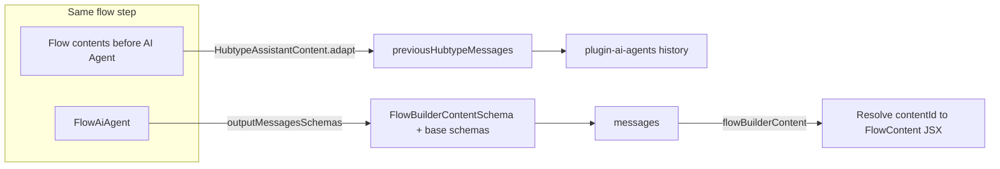

<!-- Draft PR description — aligned with `.github/pull_request_template.md` -->
<!-- Branch vs `origin/master` (merge base) -->

## Description

This pull request lets Flow Builder AI Agent nodes return **Flow Builder content by ID** (`flowBuilderContent`) via an extended structured output schema, and passes **assistant-formatted context** from any Flow contents that appear **before** the AI Agent node in the same step. It also wires **button `target`** (`_blank` / `_self`) end-to-end for AI Agent text-with-buttons, removes the legacy message-history **v1** client path in favour of **v2** with explicit memory options, and drops `isGoToFlow` from payload resolution so non-UUID values are not treated as fetchable node IDs (fix for Go To Flow follow-ups).

## Context

- **Business goal:** Designers can place content (e.g. text, carousels) ahead of an AI Agent in a single flow step and still give the model a faithful summary of what the user already “saw”; the model can optionally reference a specific Flow content by ID when the instructions ask for it.
- **Follow-up flows:** Ensuring “Go to flow” and similar paths do not break when payloads are not UUIDs (regression fix).
- **Extensibility:** Core and plugin-ai-agents types/schemas are generic so additional output message shapes (like `flowBuilderContent`) can be registered without forking the base union.

## Approach taken / Explain the design

### `@botonic/core` (0.46.1)

- `BaseMessage`, `OutputMessage`, `AgenticOutputMessage`, `RunResult`, and `InferenceResponse` accept an optional **extra message** generic so plugins can narrow agent output.
- `Button` gains optional **`target`** for URL buttons.
- `AiAgentArgs` gains **`previousHubtypeMessages`** (assistant role + string content) and **`outputMessagesSchemas`** (Zod objects merged into the output union).
- Shared **`HubtypeAssistantMessage`** / **`HubtypeUserMessage`** types for API/history usage.

### `@botonic/plugin-ai-agents` (0.46.1)

- **`getOutputSchema(externalSchemas)`** builds the agent output type from base schemas plus any extra `z.ZodObject` entries from `AiAgentArgs.outputMessagesSchemas`.
- **`MemoryOptions`** is normalized at plugin init (all fields required internally); plugin options still accept **`Partial<MemoryOptions>`**.
- **Message history:** `getMessagesV2` always sends `max_messages`, `include_tool_calls`, `max_full_tool_results`, and `debug_mode`; **`previousHubtypeMessages`** are appended before formatting/slicing. Local dev path mirrors this. **v1 `getMessages` is removed.**
- **`TextWithButtonsSchema`:** optional **`target`** enum with default `_blank`.
- Debug: removed stray `console.log` in runner; logger prints resolved memory values.

### `@botonic/plugin-flow-builder` (0.46.2)

- **AI Agent action** split under `action/ai-agent/`; **`splitAiAgentContents`** finds the `FlowAiAgent` and everything before it.
- **`FlowBuilderContentSchema`:** `type: 'flowBuilderContent'` + **`contentId`**; passed as **`outputMessagesSchemas`** when calling the AI Agent.
- **`HubtypeAssistantContent`:** adapts `FlowContent` instances (text, carousel, media, WhatsApp variants) into **plain strings** for `previousHubtypeMessages`.
- **`FlowAiAgent`:** `resolveAIAgentResponse` loads the agent, tracks events, maps messages to JSX; **`flowBuilderContent`** resolves **`contentId`** via CMS and expands to normal Flow contents.
- **`FlowBuilderAction.resolveFlowAIAgentMessages`:** when navigating to a node where the agent’s messages are still empty (e.g. follow-up), resolves the agent so **`flowBuilderContent`** and tracking stay consistent.
- **`FlowGoToFlow`:** **`followUp`** is set from the **target start node** (`getNodeByFlowId` → `id`) so follow-up behaviour matches the entered flow.
- **`FlowBuilderApi`:** **`isGoToFlow` removed** — payload handling no longer assumes UUID-looking strings are always CMS node IDs.
- **`FlowText` / `FlowButton`:** propagate **`target`** from AI Agent button payloads into Botonic text/button rendering.

## To document / Usage example

- **Flow Builder:** In the AI Agent instructions, describe when the model should emit a **`flowBuilderContent`** message with a valid **content ID** from the project; only use when the prompt explicitly allows it (schema description matches this).
- **Consumers of `@botonic/plugin-ai-agents`:** To extend output types, pass **`outputMessagesSchemas: [z.object({ ... })]`** in `AiAgentArgs` and type **`InferenceResponse<YourExtraMessage>`** in core if needed.
- **Memory:** Configure via plugin constructor **`memory`** (`Partial<MemoryOptions>`); defaults match previous behaviour (`maxMessages` etc.).

## Testing

The pull request…

- [x] has unit tests (`botonic-plugin-ai-agents`: `agent-builder`, `debug-logger`; `botonic-plugin-flow-builder`: `hubtype-assistant-content`, `ai-agent`, `flow-text`, `first-interaction`, `whatsapp-payload-conversion`, etc.)
- [ ] has integration tests
- [ ] doesn't need tests because… **N/A** — core typing changes are covered indirectly by dependent packages; run full monorepo test suite before merge if required by team policy.

### Suggested manual checks

1. Flow with **content → AI Agent**: confirm agent receives prior content in history (debug/API logs as appropriate).
2. AI Agent returns **`flowBuilderContent`** with a real content ID: UI shows resolved Flow contents.
3. **Text with buttons** from the agent with **`url`** + **`target`**: opens in correct window behaviour.
4. **Go to flow** / payloads that are **not UUIDs**: no erroneous CMS fetch; follow-up node behaves as expected.

## Related

- Jira: **BLT-2254** (branch: `BLT-2254-plugin-flow-builder-allow-go-to-flow-to-aia-gent-as-a-follow-up`)
- Prior related PRs (CHANGELOG references): **3186**, **3187**, **3188**
