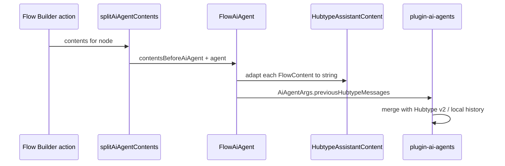

<!-- PR description (English) — delta vs current `origin/master` tip -->
<!-- Use two-dot diff: `git diff origin/master..HEAD` (not `...`) so already-merged work (e.g. #3186) is excluded -->

## Description

This change completes the **Flow Builder ↔ AI Agent** integration on top of what is already on `master`: it passes **assistant-style summaries of Flow contents that appear before the AI Agent node** into the agent’s message history (`previousHubtypeMessages`), resolves **`flowBuilderContent` output inside `FlowAiAgent`** (preserving the original content order instead of appending resolved nodes at the end), runs the agent when it appears as a **follow-up** with empty messages (`resolveFlowAIAgentMessages`), and removes the legacy **Go to flow → AI Agents flow** special case plus **`FlowBuilderApi.isGoToFlow`** usage. **`@botonic/plugin-ai-agents`** drops the **v1** message-history client, always sends **full v2** query parameters, and normalizes **memory** options internally.

## Context

`master` already includes generic structured output (`outputMessagesSchemas`), the `flowBuilderContent` schema hook for Flow Builder, `Button.target`, and related pieces from earlier PRs (e.g. **#3186**). This PR is the **incremental** layer: wiring **previous Flow step context** into Hubtype history, simplifying the **AI Agent action** (logic moves to `FlowAiAgent`), **follow-up** execution, and cleaning **Go to flow** / API helpers that are no longer needed.

## Approach taken / Explain the design (delta only)

### `@botonic/core`

- Adds **`HubtypeAssistantMessage`** and **`HubtypeUserMessage`** to the public model (same shape as before inside the plugin’s service types).
- Extends **`AiAgentArgs`** with optional **`previousHubtypeMessages`**, consumed by the AI Agents plugin when building history.

### `@botonic/plugin-ai-agents`

- **`getMessages` / `HubtypeApiClient`:** append **`previousHubtypeMessages`** to messages returned from Hubtype (v2) or local storage, then **slice** to `maxMessages` / format — so synthetic “assistant” lines from Flow Builder sit in the same window as real history.
- **Removes** the **v1** `GET …/message_history/` client; **v2** is the only path (aligned with default `messageHistoryApiVersion`).
- **`getMessagesV2`:** takes **`MemoryOptions`** with all fields required; request params always include **`max_messages`**, **`include_tool_calls`**, **`max_full_tool_results`**, **`debug_mode`** (no conditional omission).
- **`MemoryOptions`:** internal type uses **required** fields; plugin constructor still accepts **`Partial<MemoryOptions>`** via **`getMemoryOptions()`** defaults.
- **Debug:** logs the **resolved** memory object; **runner** no longer **`console.log`s** agent state.

### `@botonic/plugin-flow-builder`

- **`HubtypeAssistantContent`:** new adapter turning **`FlowContent`** (text, carousel, WhatsApp variants, media, etc.) into **plain strings** for `previousHubtypeMessages`.
- **`FlowAiAgent`:** owns **`resolveAIAgentResponse`**, tracking, **`messages` → JSX** (including **`flowBuilderContent`** resolution by content id); replaces the old **`responses`**-only shape.
- **`getContentsByAiAgent`:** uses **`splitAiAgentContents`** and delegates to **`FlowAiAgent`**; returns the **original `contents` array** (no second pass that reordered or concatenated resolved flow-builder nodes).
- **`FlowBuilderAction.resolveFlowAIAgentMessages`:** if the user lands on a node where the AI Agent’s **`messages`** are still empty (e.g. follow-up), **runs** **`resolveAIAgentResponse`** with **`contentsBeforeAiAgent`** so output and tracking stay correct.
- **`FlowBuilderApi`:** removes **`isGoToFlow`**.
- **Plugin `pre`:** removes **`FlowGoToFlow.resolveToAiAgentsFlow`** and the **`isGoToFlow(payload)`** branch (WhatsApp/AI Agents flow shortcut no longer applied here).

## To document / Usage example

- **Flow authors:** Any content **before** the AI Agent in the same step is summarized into the model context automatically; **`flowBuilderContent`** behaviour and prompt constraints are unchanged from the schema description on `master`.
- **Integrators:** When calling the agent outside Flow Builder, you can pass **`previousHubtypeMessages: [{ role: 'assistant', content: '…' }]`** in **`AiAgentArgs`** if you need the same injection pattern.

## Testing

The pull request…

- [x] has unit tests (updates/additions under `botonic-plugin-flow-builder` and `botonic-plugin-ai-agents` for the paths above)
- [ ] has integration tests
- [ ] doesn't need tests because… **N/A**

### How this was scoped

- **Compared:** `git diff origin/master..HEAD` (19 files, ~729 insertions / ~294 deletions at time of writing).
- **Not re-documented here:** generic `OutputMessage` typing, `outputMessagesSchemas` plumbing, `TextWithButtons` **`target`**, version bumps, and other items already present on **`master`** before this branch tip.

## Related

- **BLT-2254** — branch: `BLT-2254-plugin-flow-builder-allow-go-to-flow-to-aia-gent-as-a-follow-up`
- **#3186** (and related) — already on `master`; this PR builds on that baseline.
