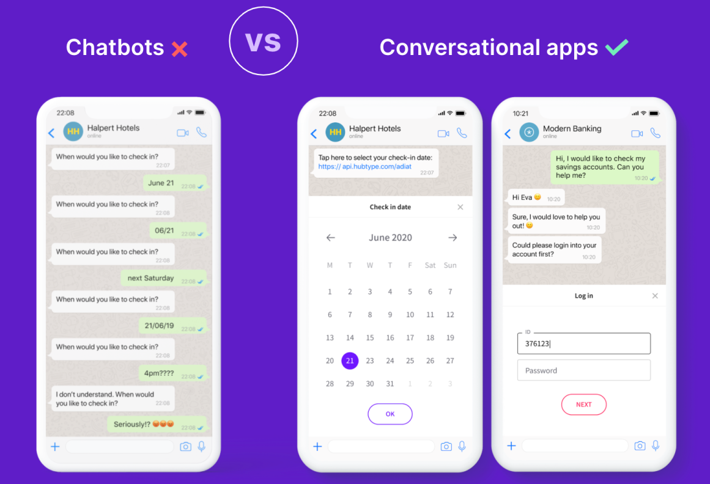

Being a software developer sometimes makes me feel like Guy Pearce in [Memento](https://www.filmaffinity.com/en/film931317.html), like literally having to erase parts of my memory filled with outdated knowledge - just to start over. <!--truncate--> Unlike Memento, it's not every 10min but it does happen every 5-10 years when a new consumer medium emerges, giving birth to a handful of competing platforms. That means, to the misery of us developers, a new set of disjoint languages, tools, APIs and developer ecosystems. PCs (Windows, Linux, Mac), the Internet (IE, Firefox, Chrome, Safari), Smartphones (Android, iOS), Game consoles, Smart TVs, VR Headsets...

<div style={{textAlign: 'center', padding: 40}}>
    
</div>

In our constant effort to get to the promised land of "code once, run anywhere"™ we've come up with endless "this is the last tech you'll ever need to learn" candidates: Java, Flash, Docker, Javascript... I still get chills thinking I was a Flash Developer back in 2010! Fast forward 10 years and I find myself building chatbots on yet another emerging medium: messaging apps and chat. So learning the ins and outs of Messenger, Telegram, Whatsapp, etc. and discovering how they come up with different concepts and APIs that represent the same abstractions:

<table style={{marginLeft: 'auto', marginRight:'auto', width: 'auto', display: 'table'}}>
    <tbody>
        <tr>
            <th><a href="https://irazasyed.github.io/telegram-bot-sdk/usage/keyboards/">Telegram Custom Keyboards</a></th>
            <th><a href="https://developers.facebook.com/docs/messenger-platform/reference/buttons/quick-replies/">Facebook Messenger Quick Replies</a></th>
        </tr>
        <tr>
            <td></td>
            <td></td>
        </tr>
    </tbody>
</table>

Oh man, here we are again.

## React lets you write one app for multiple platforms

Javascript has emerged as the best candidate so far that could lead us to the promised land. In 2021, you can run JS almost anywhere, which means you can use frameworks like React to build apps for an ever increasing number of platforms, even those who don't run JS natively thanks to tools like Electron or React Native.

I love React, [and I'm not the only one](https://insights.stackoverflow.com/survey/2020#technology-web-frameworks-all-respondents2). It's one of the few technologies I feel I won't have to unlearn in many years.

Back to my work at Hubtype, after building several chatbots for companies big and small, we started wondering: would it be possible to build a React-based framework that works on messaging platforms and uses components to abstract away all the nuances of the different providers? Something like:

```jsx
const ColorPicker = ({colors}) => (
  <Text>
		Pick a color:
		{colors.map(color =>
            <Reply payload=`color-${color.id}`>{color.name}</Reply>
        )}
  </Text>
)
```

<table style={{marginLeft: 'auto', marginRight:'auto', width: 'auto', display: 'table'}}>
    <tbody>
        <tr>
            <th>Telegram</th>
            <th>Facebook Messenger</th>
        </tr>
        <tr>
            <td></td>
            <td>
            
            </td>
        </tr>
    </tbody>
</table>

That looks pretty neat!

The best part is that it could work for the web as well as for messaging apps, although with some limitations:

1. You can't really style the UI of messaging apps like Messenger. Doing `<Reply style={{backgroundColor: "green"}}>` would only work on the web, Messenger quick replies will always look blue (unless Facebook adds an API to allow that).

2. Not all messaging apps support the same elements. Of course, there are some basic ones like `<Text>`, `<Image>`, `<Location>`, etc. that are universal in this kind of platforms. However, richer elements like `<Reply>`, `<Button>`, `<Carousel>`, etc. are supported on Messenger but not on Whatsapp, for instance.

Those limitations don't seem like a big deal, so with these ideas in mind, we started building the foundations of Botonic: **The React Framework to build Conversational Applications**.

Something we learned from our previous years of building bots is that it's not too different from building websites. With some little tweaks, concepts that are traditionally associated with frontend development like routes, views or components, are also useful in chatbot development. This is not surprising in hindsight, as chatbots are just another user interface! Not a graphical one like a website, but a conversational one ([CUI](https://en.wikipedia.org/wiki/Conversational_user_interface)). Like most UIs, the main goal of a chatbot is to transform user inputs into API requests, then parse the response and display it in a user friendly way.

That's one of the reasons why I think frontend devs are the best suited for building conversational UIs, and why React is a good fit.

## React makes it easy to mix text and graphical interfaces

Another reason why React is a good fit is that it allows you to mix text-based and graphical-based interfaces.

We realized that text-based interactions are not the best approach in many cases, for instance: logins, checkouts, selecting dates, etc. See, trying to create these features on a text only interface is a nightmare. Even if you have the best AI/NLP technology, there are other UX issues that AI can't fix: complex data input and validation, error feedback, context awareness, etc. In these cases, a good old graphical UI is the right choice.



We call this kind of experiences **conversational apps** and we want Botonic to be the best framework to build them.
