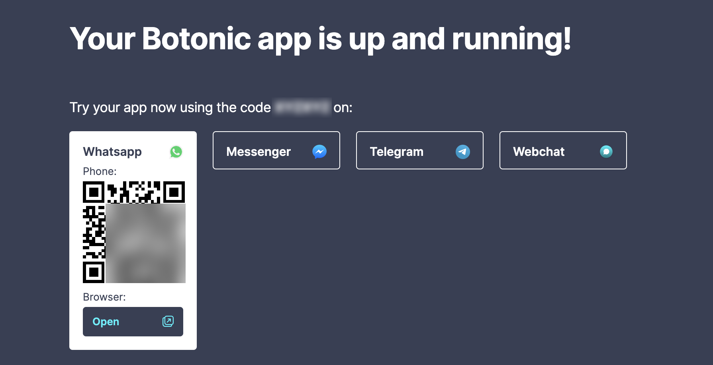

:::note TLDR;
The upcoming Botonic 1.0 release will come with live testing on WhatsApp, Messenger and Telegram.
[Try it out now, give us feedback and get a free subscription to egghead.io!](#try-it-out-and-help-us-improve)
:::

Our goal at Botonic is to make bot development as fast and easy as possible. In our 0.x versions we focused on creating the basic building blocks of the framework:

- [React components that work across all messaging apps](https://botonic.io/docs/components/components) (WhatsApp, Telegram, Messenger, Twitter DM) and the web.
- [A webchat that is fully customisable](https://botonic.io/docs/webchat/webchat).
- The [routes](https://botonic.io/docs/concepts/routes) and [actions](https://botonic.io/docs/concepts/actions) logic.
- The [plugin system](https://botonic.io/docs/plugins/botonic-plugins) (including a bunch of [official plugins](https://botonic.io/docs/plugins/plugin-contentful)).

We've now reached a point where all these features are stable and used by companies like EPSON and Levi Strauss to attend millions of customers every month. But before signaling this maturity to the world with a 1.0 release, we knew we had to do better at 3 additional areas:

- Developer experience (DX)
- Ability to self-host your Botonic apps
- Better Natural Language Understanding capabilities (NLU)

We're super excited about the progress we're doing in all these areas and can't wait to share all the details. This post is about the new developer experience, but just as a teaser, Botonic 1.0 apps will be 100% fullstack and will be easily deployed to AWS (using serverless technologies) or anywhere (using Docker). Also, the new NLU will come with intent and entity recognition, automatic translation and other niceties... anyway, let's focus on the DX for now.

## A better way to build your bots locally

As bot builders ourselves we are obsessed with improving our productivity and using tools that allow us to iterate fast. Up until now, one of the most frustrating parts of building bots was trying your local project on real messaging apps: dealing with webhooks, creating test accounts on messaging platforms, managing verifications and permissions, setting up local tunnels or deploying to 3rd party services (and waiting 5min to test every change)...

This is a terrible experience and we think it prevents many developers from even starting at bot development. Conversely, web developers enjoy local development thanks to zero setup scaffolding, live reload and production-like environments. We envisioned how this experience could be translated to bot development and worked hard to make it happen.

## Try it out and help us improve

Today we're excited to release an alpha version of Botonic 1.0 so we can get early feedback from the community. We know there are still many rough edges but we'd like to talk to as many early adopters as possible, that's why we're also giving away subscriptions to [egghead.io](https://egghead.io) to everyone that completes this short tutorial and schedules a 30min call with us.

Let's get started!

### 1. Create a new Botonic project

As pre-requisites you'll need at least [Yarn v1.15](https://classic.yarnpkg.com/en/docs/install) and [Node v12](https://nodejs.org/en/download/)

```bash
yarn create botonic-app myApp
```

This will scaffold a new Botonic project and install all the required dependencies. If you come from the 0.x series, notice that you don't need to install the framework globally anymore. Also, the project structure has changed: Botonic projects are now self-contained full-stack apps, with `api`, `webchat` and `bot` sub-packages. We'll explain this organization in detail in another post.

### 2. Start your local dev server

```bash
cd myApp
yarn serve
```

This command will start 3 servers: the REST API, the Websocket server and the frontend that includes the webchat and QR connectors to messaging APIs. Your browser should be opened automatically and display a screen like this:



:::caution
Due to a [long standing Yarn bug](https://github.com/yarnpkg/yarn/issues/4667), exiting the serve command with `CTRL-C` will leave your terminal in a bad state. You can either do `CTRL-C` again or `ENTER` to fix it.
:::

### 3. Try your bot on webchat

Now let's first try the webchat by clicking on the bottom right bubble. It will open a chat UI and you can start typing. You'll see that the bot responds "I don't understand you" all the time which is the default `404` route. Try typing "Hi" and the bot should respond with "Welcome to Botonic!"

import TryWebchat from './assets/try-webchat.png'

<div style={{textAlign: 'center'}}>
    
</div>

### 4. Try your bot on WhatsApp

It's time to feel the magic! Take your phone and scan the QR code you'll find in the WhatsApp tab. It will open a deeplink to the Botonic Playground Whatsapp account. Notice that you'll have a pre-filled text in the form of `CODE=XYZXYZ` ready to send. Send it. You should get a success message saying that your current session is linked to your local app. Congrats! You can now test your local bot right from WhatsApp, no need to create any accounts or setup any webhooks 🚀

import TryWhatsapp1 from './assets/try-whatsapp1.jpg'
import TryWhatsapp2 from './assets/try-whatsapp2.jpg'

<div style={{textAlign: 'center'}}>
    
    
</div>

You can also try the other channels. The only difference is that instead of sending a `CODE=XYZXYZ` text, you'll tap on a "Get Started" button that will send the code under the hood to connect your session.

### 5. Create your conversational app

#### 5.1 Add a main menu action

Awesome, now you're ready to build your conversational app.

[Actions](https://botonic.io/docs/concepts/actions) are one of the core concepts in Botonic. They're just React components that perform some operation and display a message to the user. In this case we want to take a collection of pizzas and display an intro text with buttons to select a pizza.

Open your project on your favourite IDE, create a new file `bot/src/actions/PizzaMenu.jsx` and paste this code:

```jsx title="bot/src/actions/PizzaMenu.jsx"
import React from 'react'
import { Text, Button } from '@botonic/react'

const pizzas = [
  { id: '1', name: 'Margherita' },
  { id: '2', name: 'Pepperoni' },
  { id: '3', name: 'Veggie' },
]

const PizzaMenu = () => (
  <Text>
    We have the best pizzas in town! Which one would you like?
    {pizzas.map(p => (
      <Button key={p.id} payload={`select-pizza-${p.id}`}>
        {p.name}
      </Button>
    ))}
  </Text>
)

export default PizzaMenu
```

You'd typically load the pizzas from an API, but we've hardcoded them here for simplicity.

#### 5.2 Add a route that triggers the main menu

Now you need a way to tell the framework when to trigger that action. You can do this with [routes](https://botonic.io/docs/concepts/routes), another core concept in Botonic. A route basically matches user inputs with actions. This match can be done in many different ways: using NLU, regex, custom functions... In this post we'll keep it simple by using regex to capture keywords. Edit your `bot/src/routes.js` file to look like this:

```jsx {2,6} title="bot/src/routes.js"
import Welcome from './actions/Welcome'
import PizzaMenu from './actions/PizzaMenu'

export const routes = [
  { text: 'hi', action: Welcome },
  { text: /(pizza|menu)/i, action: PizzaMenu },
]
```

Once you have the new action and route in place, you can try it right away. The servers will auto-reload on save and your WhatsApp session will keep working. So go back to WhatsApp and type `what's on the menu`, you should get the response with three buttons that we created in the PizzaMenu action.

#### 5.3 Add another route and action to capture the selected pizza

Ok, so let's complete the flow by capturing the button clicks. As you can see in the first action, each Button has a payload property of the form "select-pizza-1".

Now we need to capture this on our routes like this:

```jsx {3,8}
import Welcome from './actions/Welcome'
import PizzaMenu from './actions/PizzaMenu'
import PizzaSelect from './actions/PizzaSelect'

export const routes = [
  { text: 'hi', action: Welcome },
  { text: /(pizza|menu)/i, action: PizzaMenu },
  { payload: /^select-pizza-(?<pizzaId>[123])/, action: PizzaSelect },
]
```

We're capturing the ID of the pizza by using a [regex named group](https://developer.mozilla.org/en-US/docs/Web/JavaScript/Guide/Regular_Expressions/Groups_and_Ranges).

The next step is to create the `PizzaSelect` action:

```jsx title="bot/src/actions/PizzaSelect.jsx"
import React from 'react'
import { Text, Button } from '@botonic/react'

const pizzas = [
  { id: '1', name: 'Margherita' },
  { id: '2', name: 'Pepperoni' },
  { id: '3', name: 'Veggie' },
]

export default class extends React.Component {
  static async botonicInit({ params }) {
    const pizza = pizzas.find(p => p.id === params.pizzaId)
    return { pizzaName: pizza.name }
  }

  render() {
    return (
      <Text>
        Great! Your {this.props.pizzaName} pizza is on its way! 🍕🍕🍕
      </Text>
    )
  }
}
```

The captured pizza ID arrives in the `params` object in a special `botonicInit` method (if you're familiar with Next.js, this works like [getInitialProps](https://nextjs.org/docs/api-reference/data-fetching/getInitialProps)). Then we pass the pizza name as a prop to the render method.

#### 5.4 Try the whole flow

That's it! You can now play with your bot and visualize how the same flow behaves on different channels.

As you can see it's very easy to create multichannel experiences with Botonic!

import WhatsappPizzaBot from './assets/whatsapp-pizza-bot.jpg'
import MessengerPizzaBot from './assets/messenger-pizza-bot.jpg'
import TelegramPizzaBot from './assets/telegram-pizza-bot.jpg'
import WebchatPizzaBot from './assets/webchat-pizza-bot.png'

<div style={{textAlign: 'center'}}>
    
    
    
    
</div>

:::note
If this is the first time trying Botonic and you're wondering how to add natural language understanding we suggest you have a look at the [NLU example](https://botonic.io/examples/nlu-assistant/) or wait for an upcoming post that will cover the new NLP packages in Botonic 1.0
:::

### 6. Give us feedback and get your egghead.io gift card!

Congrats! You've reached till the end of this tutorial, now it's time to claim your reward 😉
The last step is to just send "/feedback" on Whatsapp/Messenger/Telegram, respond to a couple of questions and [book a call with us here](https://calendly.com/degoodmanwilson/botonic-feedback-session).

import Feedback from './assets/feedback.jpg'

<div style={{textAlign: 'center'}}>
    
</div>

:::note
You can send us feedback anytime you want just by sending "/feedback [your feedback]", for instance `/feedback I wish you had more examples!`
:::

### 7. What's next?

We'll release more blog posts explaining the new NLU packages and how to deploy your bot to AWS using serverless technologies. In the meantime we challenge you to add more features to this bot (like, adding a next step to select pizza size) and stay connected with us on [Slack](https://slack.botonic.io).

Happy coding!
